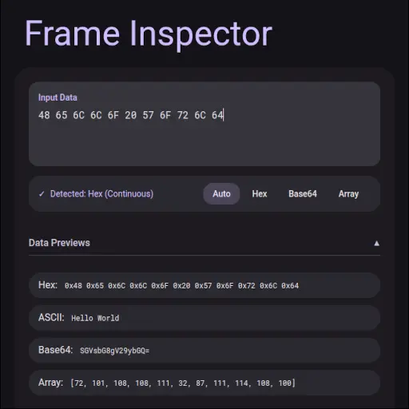

# Frame Inspector

Frame Inspector est un outil technique conçu pour l'analyse et le décodage de trames de données binaires. Il permet d'inspecter des données brutes converties instantanément en multiples formats interprétables.

L'objectif est de fournir une visualisation claire des données pour des tâches telles que le débogage de protocoles réseaux ou l'analyse de fichiers binaires. L'outil gère différents types de nombres (entiers, flottants) et plusieurs ordres d'octets (endianness).

[Accéder à l'outil en ligne](https://devleesch001.github.io/frame-inspector/)



---

## Fonctionnalités

*   **Entrées Multi-Format** : Prise en charge des formats suivants :
    *   **Hexadécimal** (formats bruts ou préfixés par `0x`).
    *   **Base64**.
    *   **Tableaux** (liste d'entiers décimaux).
*   **Décodage** : Interprétation des données en :
    *   `Int8`, `Uint8`
    *   `Int16`, `Uint16`
    *   `Int32`, `Uint32`
    *   `Int64`, `Uint64`
    *   `Float32`, `Float64`
*   **Endianness** : Support des architectures Big Endian, Little Endian, et formats mixtes.
*   **Conversions** : Visualisation ASCII, Hexadécimale, Base64 et Array.

---

## Utilisation

1.  Collez les données dans la zone de texte principale.
2.  Le format est détecté automatiquement. Si une ambiguïté existe (ex: `10` peut être `0x10` ou `[10]`), l'utilisateur peut sélectionner le mode souhaité manuellement.
3.  Les résultats s'affichent sous forme de cartes détaillant chaque interprétation possible.

---

## Exemples d'Entrées

### Hexadécimal
```text
48 65 6c 6c 6f 21
0x48 0x65 0x6c 0x6c 0x6f
48656c6c6f21
```

### Base64
```text
SGVsbG8gV29ybGQ=
```

### Tableau / Array
```text
[72, 101, 108, 108, 111]
(10, 20, 30)
10, 255, 0
```

---

## Prochaines Fonctionnalités

*   [ ] **Recherche Globale** : Recherche d'une valeur numérique spécifique dans toute la structure.

*   [ ] **Upload de fichier** : Pouvoir uploader un fichier pour l'inspecter.

*   [ ] **Detection de type de fichier** : 
    *   PDF
    *   Image (PNG, JPG, WEB, ...)
    *   Archive (ZIP, TAR)
    *   Video (MP4, AVI, ...)
    *   Audio (MP3, WAV, ...)

*   [ ] **Inspection au Survol** : Affichage des détails de la trame brute au survol d'une valeur.

*   [ ] **Ajouter des formats exotiques** : 
    *   BCD
    *   IEEE 754 
---

## Signaler un Bug

Pour signaler un problème ou proposer une amélioration :

1.  Accédez à l'onglet [Issues](https://github.com/devleesch001/frame-inspector/issues) du dépôt GitHub.
2.  Créez une nouvelle issue en décrivant le problème et en fournissant l'entrée qui a causé l'erreur.

---

## Crédits

Ce projet a été réalisé avec l'assistance d'une Intelligence Artificielle (Agent Antigravity de Google DeepMind) pour le code et la documentation.
